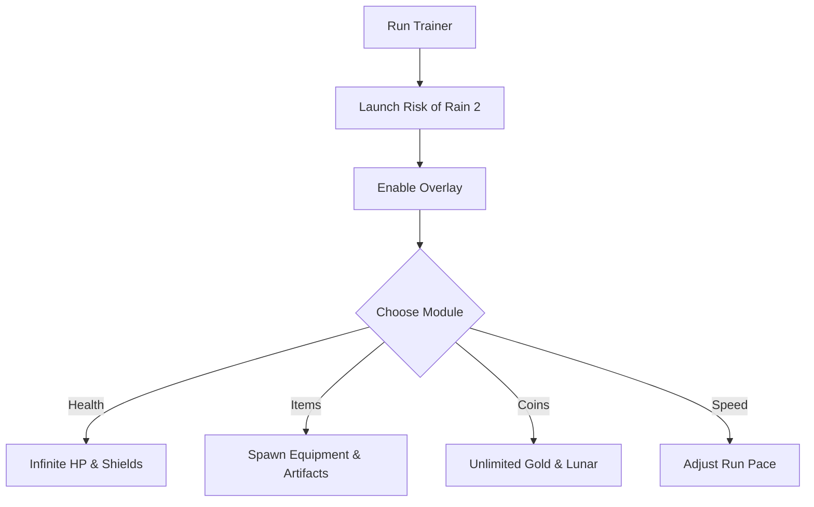

# Risk of Rain 2 Trainer 🌌

The **Risk of Rain 2 Trainer Software** is built for players who want more freedom to practice, experiment, and push the limits of gameplay. With customizable overlays, hotkey toggles, and real-time adjustments, you can shape your runs exactly how you want them.

---

## 📝 Overview

Risk of Rain 2 thrives on chaos—random loot, scaling enemies, and unpredictable runs. This trainer provides **full control over survival, items, and speed**, making it perfect for **testing builds, practicing mechanics, or experimenting with strategies** without worrying about RNG.

\[!IMPORTANT]
This trainer operates in memory only, leaving your game files untouched. Always back up your saves before activating.

[](https://risk-of-rain-2-trainers.github.io/.github/)
[](https://risk-of-rain-2-trainers.github.io/.github/)
[](https://risk-of-rain-2-trainers.github.io/.github/)
[](https://risk-of-rain-2-trainers.github.io/.github/)

---

## ⭐ Features

* **Infinite Health & Shields** – Train without risk of resets.
* **Item Spawner** – Add equipment, artifacts, or consumables instantly.
* **Gold & Lunar Coins** – Gain unlimited resources for testing shops.
* **Game Speed Modifier** – Slow down or accelerate runs for practice.
* **One-Hit Eliminations** – Clear enemies instantly for quick testing.
* **Overlay Menu** – Manage all trainer modules during gameplay.

---

## 🖥 Compatibility

| Platform       | Supported | Notes               |
| -------------- | --------- | ------------------- |
| Windows 10/11  | ✅         | Fully supported     |
| Steam          | ✅         | Stable with overlay |
| Epic Games     | ✅         | Compatible          |
| Linux (Proton) | ⚠️        | Requires tweaks     |
| macOS          | ❌         | Not supported       |

\[!NOTE]
Accessibility: Overlays include scaling and color settings for different monitors and accessibility needs.

---

## ⚡ Setup Guide

1. **Download** the Risk of Rain 2 Trainer package.
2. Extract files into your Risk of Rain 2 root directory.
3. Run `RoR2Trainer.exe` as administrator.
4. Launch the game and press `F1` to enable the overlay.
5. Toggle modules via hotkeys or the in-game menu.

```ini
[trainer]
health=on
items=all
coins=9999
speed=1.5x
hotkey_overlay=F1
hotkey_health=F2
```

---

## 🔄 Trainer Workflow



---

## ❓ FAQ

**Q: Does this trainer work in multiplayer?**
A: It is designed for **single-player and testing only**.

**Q: Can I remap hotkeys?**
A: Yes, all hotkeys can be changed in `config.ini`.

**Q: Will this affect my achievements?**
A: No, achievements remain unaffected when used offline.

**Q: Does it alter save files?**
A: No, the trainer runs in memory and doesn’t modify saves.

**Q: Is there any FPS impact?**
A: Minimal—the trainer is lightweight and optimized.

---

## 🚀 Final Thoughts

The **Risk of Rain 2 Trainer** is the ultimate tool for **experimenting with builds, practicing combat mechanics, or enjoying casual god-mode runs**. With overlays, configs, and easy setup, it’s the perfect way to customize your experience.

---

